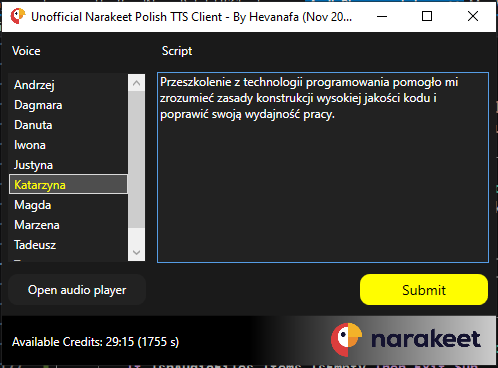

# Unofficial Narakeet Polish TTS Client

## Requirements

- Blend for Visual Studio 2017
- .NET Framework 4.7.2
- Narakeet API key

## How to Use & How it Works

Create a new file: `api_key.txt`, which contains 1 line of your Narakeet API key, which can be obtained here: https://www.narakeet.com/auth/login/

Place it in the EXE folder after building.

Whenever you press the Submit button, the app will generate an MP3 file which contains the most recently generated TTS.
